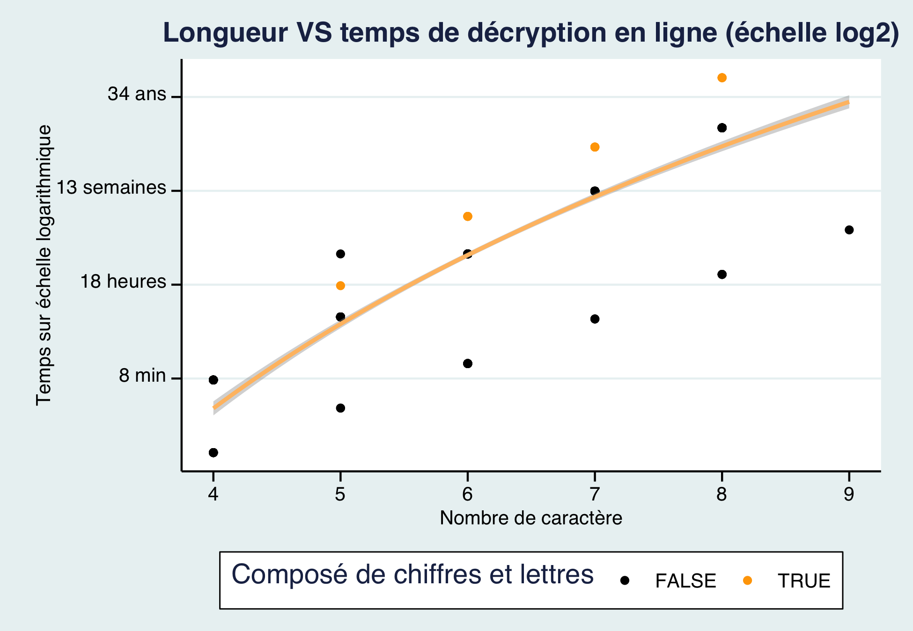

```{r setup, include=FALSE}
options(htmltools.dir.version = FALSE)
knitr::opts_chunk$set(
  fig.width=9, fig.height=3.5, fig.retina=3,
  out.width = "100%",
  cache = FALSE,
  echo = TRUE,
  message = FALSE, 
  warning = FALSE,
  hiline = TRUE
)
library(tidyverse)
```


```{r xaringan-themer, include=FALSE, warning=FALSE}
library(xaringanthemer)
style_duo_accent(
  primary_color = "#1381B0", 
  secondary_color = "#FF961C",
  inverse_header_color = "#FFFFFF"
)
```

---
class: center

```{r echo=FALSE, out.height=600, out.width= 700}

```
---
# Variables importantes de la banque de données (6/9)

- Id : la fréquence d'utilisation des mots de passe (1 étant le plus utilisé)

- Password : ex.password1234

- Category: il y a 10 différentes catégories

- Value : la valeur du temps utilisé pour décoder le mot de passe

- Time unit: l'unité de mesure du temps (seconde, heure, jour, mois, année)

- Strength : La force du mot de passe. techiquement de 1 a 10
            10 étant le plus fort

---
# Ce qui rend la clef sécuritaire :

##- Catégorie (significatif vs fictif)

--

##- Composition (simple vs complexe)

--

##- Longueur (minimal vs maximal)

---
class: center

```{r echo=FALSE, out.height=600, out.width= 700}
knitr::include_graphics("img/graph1.png")
```

---

## Les différentes catégories (n=500)

.pull-left[

- Name **(183)** ex. michael, rachel, casper

- Cool-macho **(79)** ex. master, sexy, bigdaddy, fire

- Simple-alphanumeric **(61)** ex, 12345, qwerty

- Fluffy **(44)** ex. love, iloveyou, princess, gemini

- Sport **(37)** ex. baseball, soccer, nascar

- Nerdy-pop **(30)** ex. starwars, matrix, gandalf

- Animal **(29)** ex. dragon, turtle, animal, buffalo

- Password-related **(15)** ex. password, helpme, test

- Food **(11)** ex. pepper, cheese, banana, apple

- rebellious-rude **(11)** ex. badboy, horny, sucker
]

.pull-right[
````
count_cat <- dat %>% 
  filter(!is.na(category)) %>% 
  count(category, sort=TRUE)
```
]
---

class: center

```{r echo=FALSE, out.height=600, out.width= 700}
knitr::include_graphics("img/graph2.png")
```

---

# Type de caractère vs force

- Selon Github la force des mots de passe à une échelle de 1 à 10

- Cependant 15 mots de passe ont une force de 0 (ex. 1111111 ou voodoo)
 
- et 30 sont > que 10. (ex.passw0rd ou trustno1)

- J'ai décidé de les garder puisqu'il représenter plus ou moins 10% de l'échantillon et que ceux a 0 sont clairement faible puisque le temps de décryption est le plus rapide et ceux au dessus de 10 ont un temps de décryption de plus en plus lent.


- lettres seulement : 89% de n
- Chiffres seulement : 8% de n
- Lettres et chiffres : 3% de n 

---

class: center

```{r echo=FALSE, out.height=600, out.width= 700}

```
---

class: center

```{r echo=FALSE, out.height=600, out.width= 700}

```

---

# Longueur du mot de passe

.pull-left[

- En moyenne on y retrouve 6 caractères

- Un seul mot de passe a 9 caractères (123456789)
]

.pull-right[
```{r, echo=FALSE, out.height=200, out.width= 300}

```
]

- Décryption en ligne vs hors ligne

- De plus, le temps de décryption est en proportion d'une échelle logarithmique puisque certains temps dépassaient largement les autres de facons disproportionné.

---

background-image: url(img/thatsall.gif)