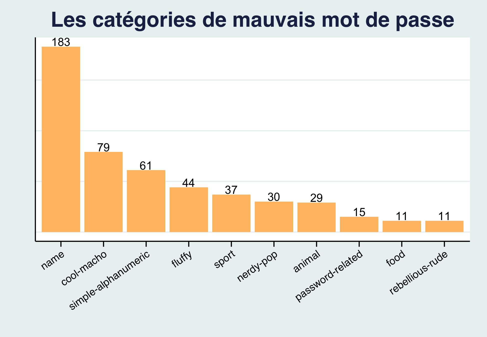
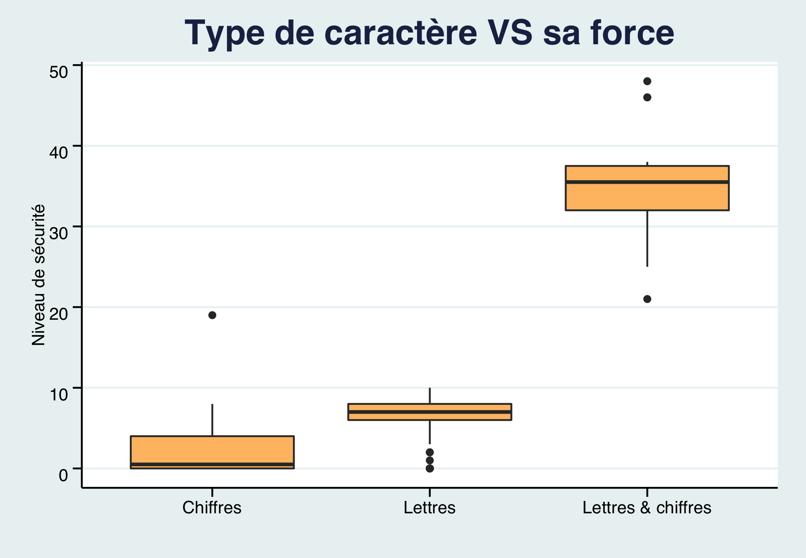

```{r, include=FALSE}
knitr::opts_chunk$set(echo = TRUE)
library(tidyverse)
library(regexplain)
library(glue)
library(ggthemes)
library(data.table)
library(janitor)
library(ggbeeswarm)
library(tinytex)
library(patchwork)
```

# Visualisation des mots des passes les plus utilisés

On a tout du le faire plusieurs fois. Changer son mot de passe n'est jamais plaisant. Le nouveau mot de passe a comme possibilité d'être entièrement différent ou une variation de son précédant. Peut-etre meme y ajouter quelques chiffres ou symboles pour le rendre plus complexe ?

La banque de données tiré de [Information is Beautiful](https://docs.google.com/spreadsheets/d/1cz7TDhm0ebVpySqbTvrHrD3WpxeyE4hLZtifWSnoNTQ/edit#gid=210) sur les 500 mots de passe les plus utilisé nous donne de très bons exemples à ne pas répéter. J'ai décidé de l'analyser pour trouver les caractérisiques qui font que ces mots de passe ne sont pas sécuritaire au dela d'être les plus utilisés.

Grâce au différente variables enregistrées, je me suis concentré sur les catégories, le temps de décryption face à la longueur des caractères et la facilité d'être piraté en fonction du type de caractère utilisé.

# L'importance de la provenance du mot de passe

 - plus de 50% de mots de passe considéré comme mauvais ici vienent de 2 catégories : Name et Cool-Macho.

-   Que ce soit un prénom ou un mot sortie directement du dictionnaire : ce n'est pas un bonne idée.

\newpage

# l'importance de la complexité du mot de passe

 Bien que la banque de données nous indique que la force des mots de passe se limite de 1 a 10 (1 étant le plus faible). On y apercoit 15 au dessus de 10 et 30 mot de passe à 0.

Alors que certain aurait enlevé les observations ne correspondant au niveau des variables, j'ai décider de les garder dans ce cas ci. Les 30 avec la force = 0 sont ceux composer de lettres ou de chiffres avec des répétitions de caractères comme : 1111111 ou voodoo. Ceux se trouvant à plus de 10 sont des mot de passe composé de lettres et de chiffres (ce qui l'est rend plus complexe)

\newpage

# L'importance d'une longueur de caractère

 
Les mots de passe de 4 caractères prennent moins de 10 minute à déchiffrers alors que ceux de 9 et plus peuvent prendre des années jusqu'à des décénnies.

Ici le temps de décryption est considéré en ligne. Une attaque de mot de passe hors-ligne est beaucoup plus rapide puisqu'elle n'est pas limité par le nombre d'essaie maximal par secondes d'un serveur.

time displayed in logarithmique scale

celui a 9 caractere cest 123456789

le point le plus haut sur le graphique estime un temps de décryption de 92 ans.


```{r, echo=FALSE}
dat_raw <- read_csv('https://raw.githubusercontent.com/rfordatascience/tidytuesday/master/data/2020/2020-01-14/passwords.csv')
#importation de la banque de données
```

```{r, echo=FALSE}
dat <- dat_raw %>% 
  mutate(
    time = case_when(
      time_unit == "seconds" ~ value,
      time_unit == "minutes" ~ value * 60,
      time_unit == "hours" ~ value * 60 * 60,
      time_unit == "days" ~ value * 60 * 24,
      time_unit == "weeks" ~ value * 60 * 24 * 7,
      time_unit == "months" ~ value * 60 * 24 * 30,
      time_unit == "years" ~ value * 60 * 24 * 365,
      TRUE ~ NA_real_
    )
  ) 

time_table <- tribble(
    ~ time_unit, ~ in_sec,
    "years", 60*60*24*365,
    "months", 60*60*24*30,
    "weeks", 60*60*24*7,
    "days", 60*60*24,
    "hours", 60*60,
    "minutes", 60,
    "seconds",  1
)
```

# J'ai pris ce chunk de code Joshua Cook, 2020

<https://github.com/jhrcook/tidy-tuesday/blob/master/2020-06-09_passwords.md>

```{r, echo=FALSE}
dat <- dat_raw %>%
    na.omit() %>% 
    mutate(password_len = str_length(password))%>% 
    left_join(time_table, by = "time_unit") %>%
    mutate(guess_crack_sec = value * in_sec) %>%
    select(-c(in_sec, value, time_unit,rank_alt,offline_crack_sec, font_size))
#j'enleve tout les NA, rajoute la variable password_len, converti le temps de décryption en secondes pour tous et j'enlève les variables inutiles

dat <- dat %>%
  mutate(type = case_when(
    grepl("[A-Za-z]+", password) & grepl("[0-9]+", password) ~ "Lettres & chiffres",
    grepl("[A-Za-z]+", password) ~ "Lettres",
    grepl("[0-9]+", password) ~ "Chiffres",
    TRUE ~ as.character(password))) 

dat <- dat %>% 
      mutate(type=as.factor(type))


#counting passwords by category only FOR graph1
count_cat <- dat %>% 
  count(category, sort=TRUE)

#new data with just passwords containing only numbers
just_numbers <- dat[dat$password %like% "^[0-9]*$", ]


#data frame password only letters
just_letters <- dat[dat$password %like% "^[a-zA-Z]+$", ]


#dataframe password letters and numbers only
both_letters_numbers <- dat[dat$password %like% '([0-9].*[a-zA-Z])|([a-zA-Z].*[0-9])', ]

mean(str_length(dat$password))
#moyenne des longueur de caractères est 6.2 donc 6.

length_tibble <- as_tibble(count(dat, password_len, sort = T))
# repartition du nombre de caractère

sum(dat$strength > 10)
# 15 mot de passe qui ont pour force plus de 10

sum(dat$strength == 0)
# 30 mots de passe qui ont pour force: 0
```

```{r}
graph1 <- ggplot(count_cat, aes(x = reorder(category, -n), y = n)) +
          geom_bar(stat = "identity", fill = "#FFBF71")+
          labs(x = " ", y = " ",
               title = "Les catégories de mauvais mot de passe") +
          theme_stata() +
          theme(plot.title = element_text(size = 20L, face = "bold.italic"),
                axis.text.x = element_text(angle = 35,vjust = 1, hjust=1),
                axis.text.y = element_blank(),
                axis.ticks.y = element_blank())+
          geom_text(aes(label = n), vjust = -0.1)


ggsave("img/graph1.png")
```

- faut expliquer pourquoi jai pris ce graphique et type
- pourquoi axis text blank, pourquoi, jai pas mis le nom de X ou Y

```{r}
graph2 <- ggplot(data = dat , aes(x = type, y = strength))+
              geom_boxplot(fill = "#FFBF71")+
              labs(x = " ",
               y = " ",
               title = "Type de caractère vs sa force")+
              ggthemes::theme_stata()+
            theme(plot.title = element_text(size = 20L, face = "bold.italic"),
                axis.text.y = element_text(angle = 0,vjust = 1, hjust=1))

graph2

ggsave("img/graph2.png")
```
alphabet
charact
TALK ABOUT LOG SCALE and why POLY LM


```{r}
dat <- dat %>%
      mutate(type=as.factor(type))

graph3 <- dat %>%
          ggplot(aes(x=(password_len), y=guess_crack_sec, color = type == "Chiffres & lettres"))+
          geom_point()+
          scale_color_manual(values = c("black", "orange"))+
          geom_smooth(formula = y ~ poly(x,2), method = "lm", color = "#FFBF71")+
          scale_y_continuous(trans = "log2", labels = c("0","8 min", "18 heures", "13 semaines", "34 ans"))+
          labs(x = "Nombre de caractère",
               y = "temps sur échelle logarithmique",
          title = "Longueur vs temps de décryption (échelle log2)",
          color='Composé de chiffres et lettres')+
          ggthemes::theme_stata() +
          theme(plot.title = element_text(size = 14L, face = "bold"),
                axis.text.y = element_text(angle = 0,vjust = 1, hjust=1))


ggsave("img/graph3.png")
```

- pourquoi labs blank
-pourquoi boxplot

# GROUP DATA BY CHUNK genre les 25 premier plus utiliser moyenne de decryption 50 moyen de decryption 70 etc et faire graphique

DIRE A LA FIN SQUE JE VOUDRAIS APPRENDRE POUR FAIRE NEXT TIME OU SQUE JAI MANQUER

SQUE JVEUX VRMT FAIRE CEST SCRAPER LES 1000 PLUS UTLISER SUR WIKI ET DAUTRE SITE ET REFAIRE MON DERNIER GRAPHIQUE MAIS JAI PAS EU LE TEMPS.

genre je devrais plus approfondir dans les regex ou nahhh genre apronfondire mes graphiques i guesss idk...

ben puisque le daat vient de 2014 peut-etre avoir les mots de passe de 2015-16 jsuqua 2021 serait cool pour appronfondir les changements et ceux qui reste toujours

aussi les categories sont vrmt arbitraires et plates pis jveut savoir qui a fait ca.

DIT QUE TA ESSAYER 100K mais ta pas dautre variable vrmt
